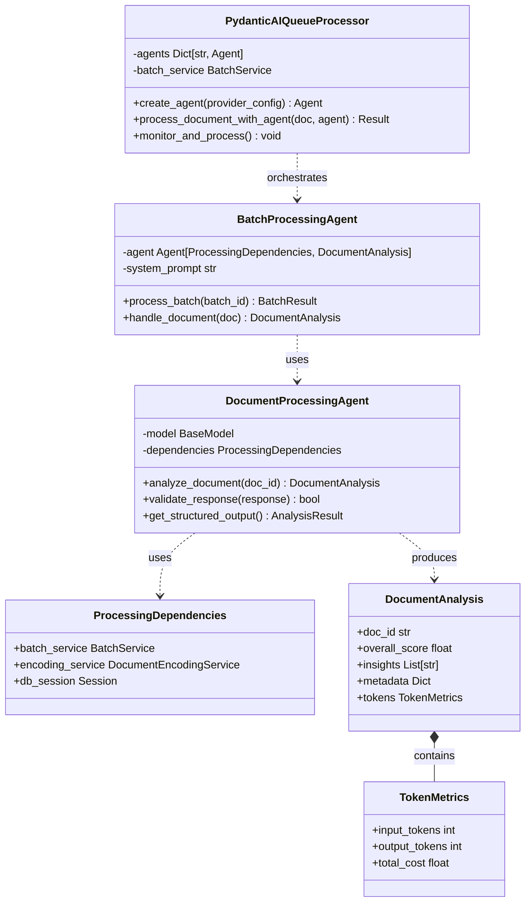

# PydanticAI Integration for Document Processing

## Overview

PydanticAI can enhance our document processing architecture by providing:
- Type-safe LLM interactions
- Structured response validation
- Built-in support for multiple LLM providers
- Dependency injection for clean service integration

## Architecture with PydanticAI



## Implementation Example

### 1. Define Pydantic Models for Structured Outputs

```python
from pydantic import BaseModel, Field
from typing import List, Dict, Optional
from datetime import datetime

class TokenMetrics(BaseModel):
    input_tokens: int = Field(description="Number of input tokens")
    output_tokens: int = Field(description="Number of output tokens")
    total_cost: float = Field(description="Total cost in USD")

class DocumentAnalysis(BaseModel):
    doc_id: str = Field(description="Document identifier")
    overall_score: float = Field(ge=0, le=100, description="Overall quality score")
    insights: List[str] = Field(description="Key insights from the document")
    categories: List[str] = Field(description="Document categories")
    metadata: Dict[str, Any] = Field(default_factory=dict)
    tokens: TokenMetrics
    processing_time_ms: int

class BatchResult(BaseModel):
    batch_id: int
    total_documents: int
    successful: int
    failed: int
    average_score: float
    total_tokens: TokenMetrics
    processing_time_seconds: float
```

### 2. Create Document Processing Agent

```python
from pydantic_ai import Agent, RunContext
from pydantic_ai.models.openai import OpenAIModel
from typing import Tuple

class DocumentProcessingAgent:
    def __init__(self, provider_config: Dict[str, Any]):
        # Initialize the appropriate model based on provider
        self.model = self._create_model(provider_config)
        
        # Define the agent with structured output
        self.agent = Agent(
            self.model,
            result_type=DocumentAnalysis,
            system_prompt=self._get_system_prompt(),
            deps_type=ProcessingDependencies
        )
        
        # Register tools
        self._register_tools()
    
    def _create_model(self, config: Dict[str, Any]):
        provider = config.get('provider_type')
        if provider == 'openai':
            return OpenAIModel(
                model=config.get('model_name', 'gpt-4'),
                api_key=config.get('api_key'),
                base_url=config.get('base_url')
            )
        # Add other providers...
    
    def _get_system_prompt(self) -> str:
        return """You are a document analysis expert. 
        Analyze the provided document and return structured insights 
        including quality score, key findings, and categorization."""
    
    def _register_tools(self):
        @self.agent.tool
        async def get_document_content(
            ctx: RunContext[ProcessingDependencies], 
            doc_id: str
        ) -> Tuple[str, Dict]:
            """Retrieve document content and metadata"""
            doc = await ctx.deps.batch_service.get_document(doc_id)
            return doc['content'], doc['metadata']
        
        @self.agent.tool
        async def calculate_score(
            ctx: RunContext[ProcessingDependencies],
            insights: List[str]
        ) -> float:
            """Calculate document quality score based on insights"""
            # Scoring logic here
            return 85.0
```

### 3. Integration with KnowledgeQueueProcessor

```python
from pydantic_ai import Agent
import asyncio
from typing import Dict, List

class PydanticAIQueueProcessor:
    def __init__(self, batch_service: BatchService):
        self.batch_service = batch_service
        self.agents: Dict[str, DocumentProcessingAgent] = {}
        self.is_running = False
    
    async def create_agent_for_connection(self, connection: Dict) -> DocumentProcessingAgent:
        """Create a PydanticAI agent for a specific LLM connection"""
        agent = DocumentProcessingAgent(connection)
        self.agents[connection['id']] = agent
        return agent
    
    async def process_document(self, document: Dict, connection: Dict) -> DocumentAnalysis:
        """Process a single document using PydanticAI agent"""
        # Get or create agent for this connection
        if connection['id'] not in self.agents:
            agent = await self.create_agent_for_connection(connection)
        else:
            agent = self.agents[connection['id']]
        
        # Create dependencies
        deps = ProcessingDependencies(
            batch_service=self.batch_service,
            encoding_service=DocumentEncodingService(),
            db_session=Session()
        )
        
        # Run the agent
        result = await agent.agent.run(
            f"Analyze document {document['id']}",
            deps=deps
        )
        
        return result.data
    
    async def monitor_and_process(self):
        """Main processing loop using PydanticAI"""
        while self.is_running:
            try:
                # Get batches ready for processing
                batches = await self.batch_service.get_batches_ready_for_processing()
                
                for batch in batches:
                    # Get next document
                    doc = await self.batch_service.get_next_document_for_processing(
                        batch['batch_id']
                    )
                    
                    if doc:
                        # Process with PydanticAI
                        result = await self.process_document(
                            doc, 
                            doc['llm_config']
                        )
                        
                        # Update batch service with results
                        await self.batch_service.update_document_status(
                            doc['doc_id'],
                            'COMPLETED',
                            result.model_dump()
                        )
                        
                await asyncio.sleep(5)
                
            except Exception as e:
                logger.error(f"Error in processing loop: {e}")
```

## Benefits of Using PydanticAI

### 1. **Type Safety**
- Structured responses with automatic validation
- Compile-time type checking for tool parameters
- Reduces runtime errors

### 2. **Multi-Provider Support**
- Built-in support for OpenAI, Anthropic, Gemini, etc.
- Easy to switch between providers
- Consistent interface across providers

### 3. **Dependency Injection**
- Clean separation of concerns
- Easy testing with mock dependencies
- Flexible service composition

### 4. **Streaming Support**
- Real-time response validation
- Progress updates during processing
- Better user experience

### 5. **Built-in Monitoring**
- Integration with Logfire for debugging
- Token usage tracking
- Performance metrics

## Migration Strategy

### Phase 1: Pilot Implementation
1. Create PydanticAI agents for document analysis
2. Test with a subset of connections
3. Compare results with existing implementation

### Phase 2: Gradual Rollout
1. Replace RAG API calls with PydanticAI agents
2. Maintain backward compatibility
3. Monitor performance and accuracy

### Phase 3: Full Integration
1. Migrate all LLM interactions to PydanticAI
2. Leverage advanced features (streaming, A2A)
3. Optimize based on production metrics

## Code Changes Required

### 1. Update Requirements
```txt
pydantic-ai>=0.0.7
pydantic>=2.0
```

### 2. Modify KnowledgeQueueProcessor
- Replace direct RAG API calls with PydanticAI agents
- Use structured outputs instead of JSON parsing
- Leverage async/await for better concurrency

### 3. Enhanced Error Handling
- Use Pydantic validation errors
- Implement retry logic with exponential backoff
- Better error categorization

## Conclusion

PydanticAI provides a production-ready framework that aligns well with the document processing architecture. Its type safety, multi-provider support, and structured outputs would significantly improve the robustness and maintainability of the system.