# DocumentEvaluator Service Layer Architecture

## Class Diagram

```mermaid
classDiagram
    %% Base Classes
    class BaseLLMProvider {
        <<abstract>>
        #provider_type: str
        #logger: Logger
        +__init__(provider_type)
        +test_connection(config)*
        +discover_models(config)*
        +validate_config(config)*
        +get_default_config()
        +format_error_message(error)
    }

    %% Provider Implementations
    class OllamaProvider {
        +test_connection(config)
        +discover_models(config)
        +validate_config(config)
        -_make_request(endpoint, config)
    }

    class OpenAIProvider {
        +test_connection(config)
        +discover_models(config)
        +validate_config(config)
        -_get_api_key(config)
    }

    class LMStudioProvider {
        +test_connection(config)
        +discover_models(config)
        +validate_config(config)
    }

    class AmazonProvider {
        +test_connection(config)
        +discover_models(config)
        +validate_config(config)
        -_get_bedrock_client(config)
    }

    class GrokProvider {
        +test_connection(config)
        +discover_models(config)
        +validate_config(config)
    }

    %% Core Service Classes
    class BatchService {
        <<service>>
        +__init__()
        +create_batch(batch_data)
        +save_batch(folder_ids, connection_ids, prompt_ids, batch_name, description, meta_data)
        +stage_batch(folder_ids, connection_ids, prompt_ids, batch_name, description, meta_data)
        +restage_batch(batch_id)
        +update_batch(batch_id, updates)
        +get_batch(batch_id)
        +cancel_batch(batch_id)
        +get_batch_progress(batch_id)
        +get_staging_status(batch_id)
        +run_batch(batch_id)
        +rerun_batch(batch_id)
        +list_batches(limit, offset)
        +get_batch_summary_stats(batch_ids)
        +_create_config_snapshot(folder_ids)
        +_perform_staging(session, batch_id, folder_ids, connection_ids, prompt_ids, encoding_service)
        -_handle_llm_response_deprecation(method_name)
    }

    class ConnectionService {
        <<service>>
        -provider_service: LlmProviderService
        +__init__()
        +get_all_connections()
        +get_connection_by_id(connection_id)
        +create_connection(connection_data)
        +update_connection(connection_id, connection_data)
        +test_connection(connection_id, test_config)
        +delete_connection(connection_id)
    }

    class ModelService {
        <<service>>
        +get_all_models()
        +get_model_by_id(model_id)
        +create_model(model_data)
        +update_model(model_id, model_data)
        +discover_and_link_models(provider_id, discovered_models)
        +delete_model(model_id)
    }

    class DocumentEncodingService {
        <<service>>
        -supported_extensions: set
        -doc_config: DocumentConfig
        +__init__()
        +encode_and_store_document(file_path, session)
        +get_encoded_document_by_path(file_path, session)
        +prepare_document_for_llm(document, session)
        +batch_encode_documents(file_paths, session)
    }

    class FolderPreprocessingService {
        <<service>>
        -session: Session
        -doc_config: DocumentConfig
        -VALID_EXTENSIONS: set
        +__init__()
        +preprocess_folder_async(folder_path, folder_name, task_id, app)
        +preprocess_folder(folder_path, folder_name)
        +get_folder_status(folder_id)
        -_scan_folder_files(folder_path)
    }

    class LlmProviderService {
        <<service>>
        -provider_adapters: Dict
        +__init__()
        +get_all_providers()
        +get_provider_by_id(provider_id)
        +create_provider(provider_data)
        +test_connection(provider_config)
        +discover_models(provider_id, provider_config)
    }

    class ServiceHealthMonitor {
        <<service>>
        -check_interval: int
        -health_checks: Dict
        -current_status: Dict
        -monitoring_thread: Thread
        -stop_monitoring: bool
        -max_history: int
        +__init__(check_interval)
        +start_monitoring()
        +stop_monitoring_service()
        +get_service_status(service_name)
        +get_all_service_status()
        +check_service_now(service_name)
    }

    class ModelNormalizationService {
        <<service>>
        +normalize_model_name(model_name)
        +extract_model_info(model_name)
        +is_similar_model(model1, model2)
    }

    class BatchArchiveService {
        <<service>>
        +archive_batch(batch_id)
        +restore_batch(batch_id)
        +list_archived_batches()
    }

    class BatchCleanupService {
        <<service>>
        +cleanup_old_batches(days_old)
        +cleanup_failed_batches()
        +get_cleanup_candidates(days_old)
    }

    class StartupRecovery {
        <<service>>
        +recover_interrupted_tasks()
        +check_batch_consistency()
        +reset_stuck_connections()
    }

    class KnowledgeQueueProcessor {
        <<service>>
        -processing_thread: Thread
        -stop_processing: bool
        -max_concurrent: int
        +__init__(max_concurrent)
        +start_processing()
        +stop_processing()
        +get_queue_status()
        +process_document(doc_id)
    }

    class DynamicProcessingQueue {
        <<deprecated>>
        -check_interval: int
        -max_outstanding: int
        -queue_thread: Thread
        -stop_queue: bool
        -processing_lock: Lock
        +__init__(check_interval, max_outstanding)
        +start_queue_processing()
        +stop_queue_processing()
        +get_queue_status()
        +force_process_waiting()
    }

    %% Relationships
    
    %% Inheritance
    OllamaProvider --|> BaseLLMProvider
    OpenAIProvider --|> BaseLLMProvider
    LMStudioProvider --|> BaseLLMProvider
    AmazonProvider --|> BaseLLMProvider
    GrokProvider --|> BaseLLMProvider

    %% Dependencies
    ConnectionService --> LlmProviderService : uses
    LlmProviderService --> ModelService : uses
    BatchService --> DocumentEncodingService : uses
    FolderPreprocessingService ..> DocumentEncodingService : uses
    ModelService --> ModelNormalizationService : uses

    %% Aggregation
    LlmProviderService o-- BaseLLMProvider : provider_adapters

    %% Notes
    note for BatchService "Unified service handling both\nbatch management and staging"
    note for DynamicProcessingQueue "DEPRECATED: Moved to\nKnowledgeDocuments DB"
    note for KnowledgeQueueProcessor "Replacement for\nDynamicProcessingQueue"
```

## Service Layer Overview

### Core Services

#### BatchService

- **Purpose**: Manages the complete lifecycle of document processing batches
- **Key Responsibilities**:
  - Creating batches (SAVED status)
  - Staging batches (preparing documents for LLM processing)
  - Running batch processing
  - Tracking batch progress and status
  - Managing batch configuration snapshots
- **Status Flow**: `SAVED` → `STAGING` → `STAGED` → `PROCESSING` → `COMPLETED`

#### ConnectionService

- **Purpose**: Manages LLM provider connections
- **Key Features**:
  - CRUD operations for connections
  - Connection testing and validation
  - Integration with provider-specific implementations

#### ModelService

- **Purpose**: Manages LLM models across different providers
- **Key Features**:
  - Model discovery and registration
  - Model normalization for cross-provider compatibility
  - Model activation/deactivation

#### LlmProviderService

- **Purpose**: Abstract interface for different LLM providers
- **Supported Providers**:
  - OpenAI
  - Ollama
  - LMStudio
  - Amazon Bedrock
  - Grok
- **Key Features**:
  - Provider adapter pattern
  - Unified API for provider operations

### Supporting Services

#### DocumentEncodingService

- Handles document encoding and preparation
- Supports multiple file formats
- Base64 encoding for storage

#### FolderPreprocessingService

- Scans folders for documents
- Validates document types
- Async processing support

#### ServiceHealthMonitor

- Monitors external service availability
- Background health checks
- Service status reporting

#### KnowledgeQueueProcessor

- Processes documents in the KnowledgeDocuments database
- Replaces the deprecated DynamicProcessingQueue
- Manages concurrent processing slots

### Utility Services

#### ModelNormalizationService

- Normalizes model names across providers
- Extracts model metadata
- Model similarity comparison

#### BatchArchiveService

- Archives completed batches
- Batch restoration functionality
- Archive management

#### BatchCleanupService

- Automated cleanup of old batches
- Failed batch management
- Resource optimization

#### StartupRecovery

- Recovers interrupted tasks on startup
- Batch consistency checks
- Connection state recovery

## Design Patterns

1. **Singleton Pattern**: All services are instantiated as global singletons
2. **Abstract Factory Pattern**: `BaseLLMProvider` for provider implementations
3. **Adapter Pattern**: Provider-specific adapters implement common interface
4. **Service Layer Pattern**: Clear separation of business logic from data access
5. **Observer Pattern**: Health monitoring runs independently in background

## Database Architecture

- **Primary Database**: PostgreSQL (`doc_eval`)
- **Secondary Database**: PostgreSQL (`KnowledgeDocuments`)
- **ORM**: SQLAlchemy with Alembic migrations
- **Connection**: `postgres:prodogs03@studio.local:5432/doc_eval`

## Key Architectural Decisions

1. **Unified BatchService**: Staging is now a method of BatchService rather than a separate service
2. **Deprecated Components**: DynamicProcessingQueue moved to KnowledgeDocuments database
3. **Configuration Snapshots**: Ensures consistency across batch lifecycle
4. **Two-Stage Processing**: Document preparation (staging) separated from LLM processing
5. **Provider Abstraction**: Common interface for all LLM providers
