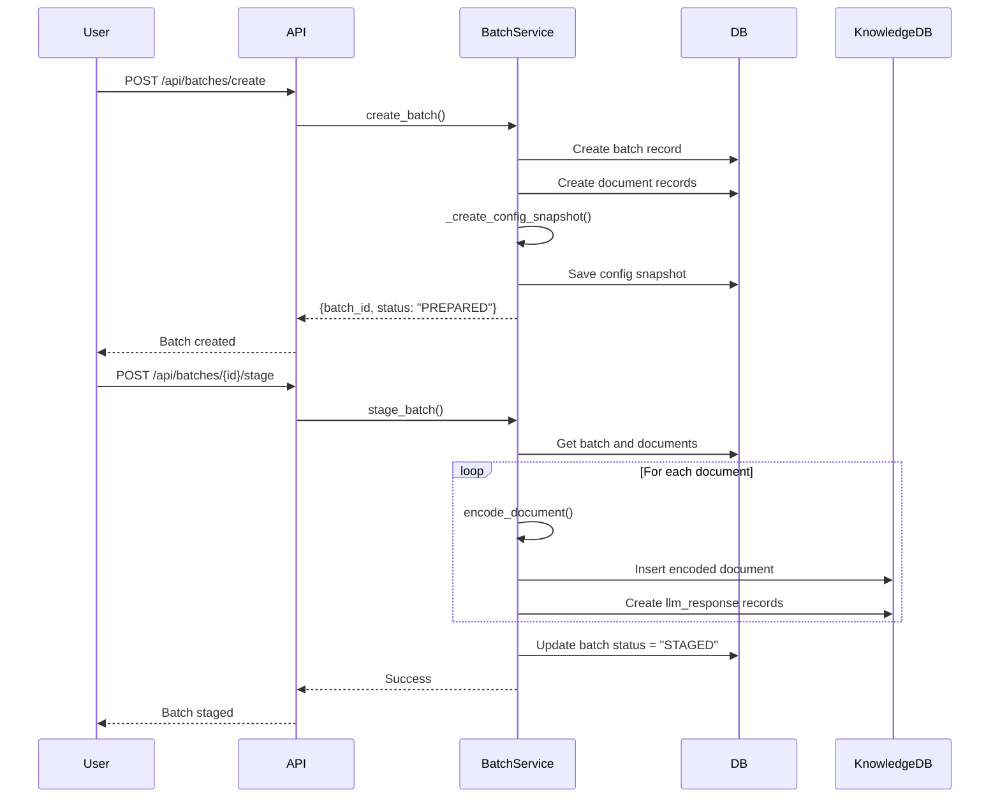
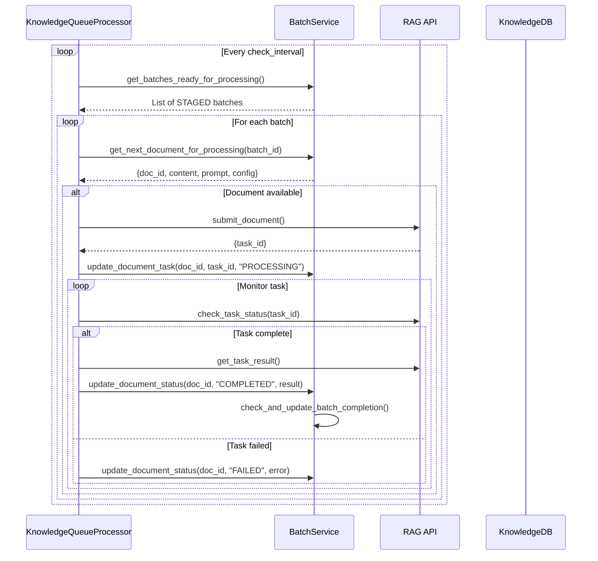

# Document Processing Service Architecture Design

## Overview

This document outlines the redesigned architecture for the BatchService and KnowledgeQueueProcessor interaction, ensuring clear separation of responsibilities and proper control flow.

## Architecture Principles

1. **BatchService** controls all batch and document state management
2. **KnowledgeQueueProcessor** handles asynchronous processing and external API communication
3. Clear API boundaries between services
4. No direct database access from KnowledgeQueueProcessor for batch/document operations

## Class Design

### BatchService

The central controller for all batch operations.

```python
class BatchService:
    """Unified service for managing document processing batches"""
    
    # Core batch operations
    def create_batch(name: str, folder_ids: List[int], meta_data: Dict) -> Dict
    def stage_batch(batch_id: int) -> Dict
    def get_batch_status(batch_id: int) -> Dict
    def rerun_batch(batch_id: int) -> Dict
    
    # New methods for queue processor integration
    def get_batches_ready_for_processing() -> List[Dict]
    def get_next_document_for_processing(batch_id: int) -> Optional[Dict]
    def update_document_task(doc_id: int, task_id: str, status: str) -> bool
    def update_document_status(doc_id: int, status: str, response_data: Dict = None) -> bool
    def check_and_update_batch_completion(batch_id: int) -> bool
    
    # Internal methods
    def _create_config_snapshot(folder_ids: List[int]) -> Dict
    def _handle_batch_completion(batch: Batch) -> void
```

### KnowledgeQueueProcessor

Asynchronous processor that monitors for work and handles RAG API communication.

```python
class KnowledgeQueueProcessor:
    """Process documents through RAG API with batch coordination"""
    
    # Lifecycle management
    def start() -> void
    def stop() -> void
    def get_status() -> Dict
    
    # Batch processing methods
    def monitor_batches() -> void
    def process_batch_document(batch_id: int) -> Dict
    def report_task_completion(doc_id: int, status: str, result: Dict) -> void
    
    # Internal processing
    def _process_loop() -> void
    def _get_processing_count() -> int
    def _call_rag_api(llm_config: Dict, prompt: str, document_id: str) -> str
    def _handle_task_status_check(task_id: str) -> Dict
```

## Sequence Flow

### 1. Batch Creation and Staging



### 2. Automatic Processing Loop



## State Management

### Batch States

| State | Description | Transitions |
|-------|-------------|-------------|
| CREATED | Initial state, no documents | → PREPARED |
| PREPARED | Documents added, config captured | → STAGED, FAILED |
| STAGED | Documents encoded, ready for processing | → PROCESSING, FAILED |
| PROCESSING | Active document processing | → COMPLETED, FAILED |
| COMPLETED | All documents processed | → STAGED (rerun) |
| FAILED | Unrecoverable error | Terminal state |

### Document/LLM Response States

| State | Description | Transitions |
|-------|-------------|-------------|
| CREATED | Document record exists | → ENCODED, ENCODING_FAILED |
| ENCODED | Document encoded in KnowledgeDB | → QUEUED |
| QUEUED | Ready for processing | → PROCESSING |
| PROCESSING | Task submitted, has task_id | → COMPLETED, FAILED, TIMEOUT |
| COMPLETED | Response received | → QUEUED (rerun) |
| FAILED | Processing error | → QUEUED (retry) |
| TIMEOUT | Task exceeded time limit | → QUEUED (retry) |

## API Contracts

### BatchService → KnowledgeQueueProcessor

#### get_batches_ready_for_processing()
```json
Response: [
    {
        "batch_id": 123,
        "batch_number": 70,
        "batch_name": "Q4 Analysis",
        "total_documents": 50,
        "processed_documents": 0,
        "status": "STAGED"
    }
]
```

#### get_next_document_for_processing(batch_id)
```json
Response: {
    "doc_id": 456,
    "batch_id": 123,
    "document_id": "batch_123_doc_456",
    "encoded_content": "base64...",
    "prompt": {
        "id": 1,
        "text": "Analyze this document..."
    },
    "llm_config": {
        "provider": "openai",
        "model": "gpt-4",
        "temperature": 0.7
    }
}
```

#### update_document_task(doc_id, task_id, status)
```json
Request: {
    "doc_id": 456,
    "task_id": "rag_task_789",
    "status": "PROCESSING"
}
Response: {"success": true}
```

#### update_document_status(doc_id, status, response_data)
```json
Request: {
    "doc_id": 456,
    "status": "COMPLETED",
    "response_data": {
        "response_text": "Analysis results...",
        "input_tokens": 1500,
        "output_tokens": 500,
        "response_time_ms": 2500,
        "scores": {...}
    }
}
Response: {"success": true, "batch_complete": false}
```

## Implementation Strategy

### Phase 1: BatchService Methods
1. Implement `get_batches_ready_for_processing()`
2. Implement `get_next_document_for_processing()`
3. Implement `update_document_task()`
4. Implement `update_document_status()`
5. Implement `check_and_update_batch_completion()`

### Phase 2: KnowledgeQueueProcessor Refactoring
1. Replace direct DB queries with BatchService calls
2. Implement `monitor_batches()` method
3. Refactor `_process_single_item()` to use new flow
4. Add proper error handling and recovery

### Phase 3: Testing and Validation
1. Unit tests for new BatchService methods
2. Integration tests for complete workflow
3. Error scenario testing
4. Performance validation

## Benefits

1. **Clear Separation of Concerns**: BatchService owns state, KnowledgeQueueProcessor handles processing
2. **Better Error Recovery**: Centralized state management enables consistent recovery
3. **Easier Testing**: Clear API boundaries make unit testing straightforward
4. **Scalability**: KnowledgeQueueProcessor instances can scale independently
5. **Maintainability**: Single source of truth for batch/document state

## Migration Notes

- Existing batch processing will continue to work during migration
- KnowledgeQueueProcessor can be updated incrementally
- No database schema changes required
- Backward compatibility maintained for existing API endpoints