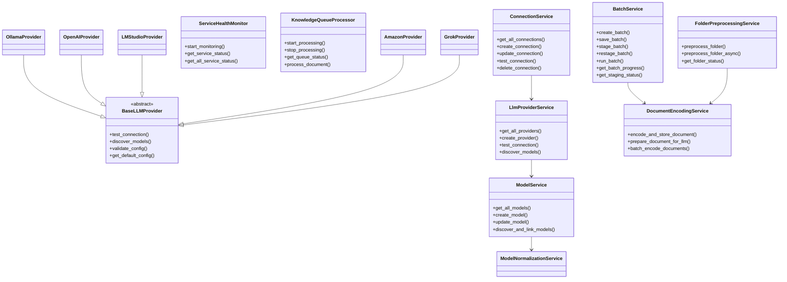

# DocumentEvaluator Service Layer Architecture

## Simplified Class Diagram (Mermaid 8.8.0 Compatible)



## Service Relationships

### Inheritance Hierarchy
- **BaseLLMProvider** (Abstract Base Class)
  - OllamaProvider
  - OpenAIProvider
  - LMStudioProvider
  - AmazonProvider
  - GrokProvider

### Service Dependencies
- **BatchService** → DocumentEncodingService
  - Uses for document preparation during staging
- **ConnectionService** → LlmProviderService
  - Uses for provider-specific operations
- **LlmProviderService** → ModelService
  - Uses for model discovery and management
- **FolderPreprocessingService** → DocumentEncodingService
  - Uses for document encoding
- **ModelService** → ModelNormalizationService
  - Uses for model name normalization

## Key Services Description

### BatchService (Unified)
The BatchService now incorporates staging functionality:
- `save_batch()` - Creates batch in SAVED status
- `stage_batch()` - Creates and stages batch in one operation
- `restage_batch()` - Re-stages existing batch
- `run_batch()` - Executes batch processing
- `get_staging_status()` - Gets current staging status

### Status Flow
```
SAVED → STAGING → STAGED → PROCESSING → COMPLETED
         ↓
    FAILED_STAGING
```

### Provider Architecture
Each provider implements the BaseLLMProvider interface:
- Connection testing
- Model discovery
- Configuration validation
- Default configuration

### Database Integration
- **Primary DB**: PostgreSQL (doc_eval)
- **Secondary DB**: PostgreSQL (KnowledgeDocuments)
- **Staging Process**: Documents encoded in doc_eval, staged to KnowledgeDocuments

## Architectural Benefits

1. **Unified BatchService**: Eliminates code duplication between batch and staging
2. **Provider Abstraction**: Easy to add new LLM providers
3. **Service Layer Pattern**: Clear separation of concerns
4. **Configuration Snapshots**: Ensures consistency across batch lifecycle
5. **Background Processing**: Health monitoring and queue processing run independently