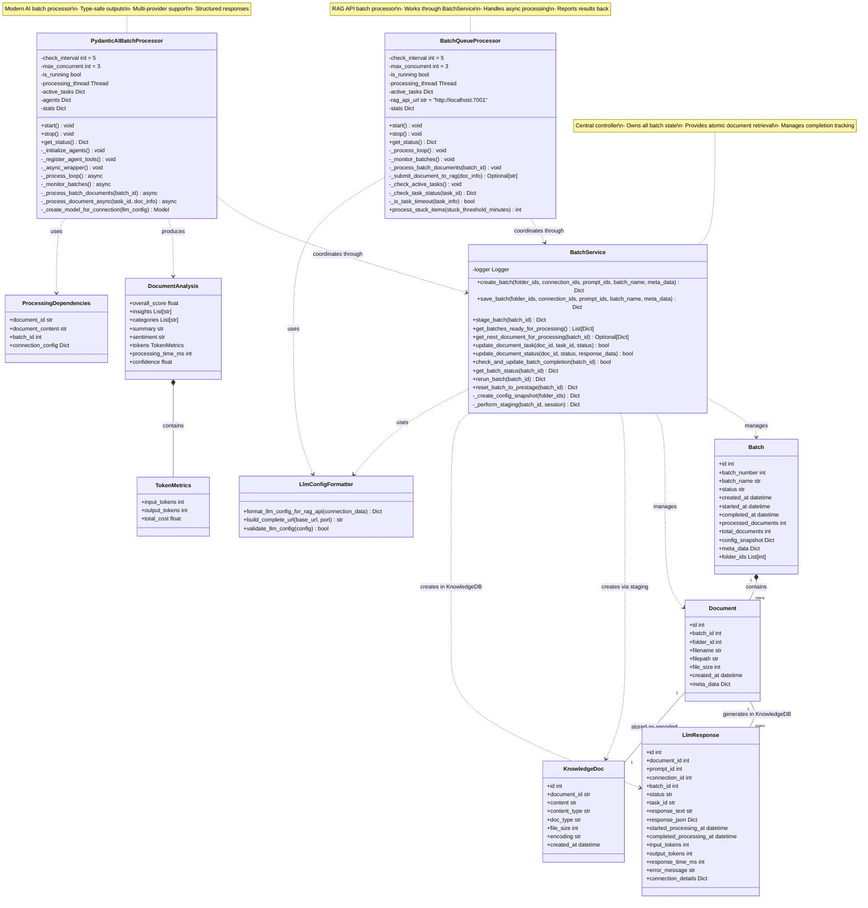

# Service Architecture - Class Diagram

```mermaid
classDiagram
    class BatchService {
        -logger Logger
        +create_batch(folder_ids, connection_ids, prompt_ids, batch_name, meta_data) Dict
        +save_batch(folder_ids, connection_ids, prompt_ids, batch_name, meta_data) Dict
        +stage_batch(batch_id) Dict
        +get_batches_ready_for_processing() List[Dict]
        +get_next_document_for_processing(batch_id) Optional[Dict]
        +update_document_task(doc_id, task_id, status) bool
        +update_document_status(doc_id, status, response_data) bool
        +check_and_update_batch_completion(batch_id) bool
        +get_batch_status(batch_id) Dict
        +rerun_batch(batch_id) Dict
        +reset_batch_to_prestage(batch_id) Dict
        -_create_config_snapshot(folder_ids) Dict
        -_perform_staging(batch_id, session) Dict
    }

    class BatchQueueProcessor {
        -check_interval int = 5
        -max_concurrent int = 3
        -is_running bool
        -processing_thread Thread
        -active_tasks Dict
        -rag_api_url str = "http://localhost:7001"
        -stats Dict
        +start() void
        +stop() void
        +get_status() Dict
        -_process_loop() void
        -_monitor_batches() void
        -_process_batch_documents(batch_id) void
        -_submit_document_to_rag(doc_info) Optional[str]
        -_check_active_tasks() void
        -_check_task_status(task_id) Dict
        -_is_task_timeout(task_info) bool
        +process_stuck_items(stuck_threshold_minutes) int
    }

    class PydanticAIBatchProcessor {
        -check_interval int = 5
        -max_concurrent int = 3
        -is_running bool
        -processing_thread Thread
        -active_tasks Dict
        -agents Dict
        -stats Dict
        +start() void
        +stop() void
        +get_status() Dict
        -_initialize_agents() void
        -_register_agent_tools() void
        -_async_wrapper() void
        -_process_loop() async
        -_monitor_batches() async
        -_process_batch_documents(batch_id) async
        -_process_document_async(task_id, doc_info) async
        -_create_model_for_connection(llm_config) Model
    }

    class DocumentAnalysis {
        +overall_score float
        +insights List[str]
        +categories List[str]
        +summary str
        +sentiment str
        +tokens TokenMetrics
        +processing_time_ms int
        +confidence float
    }

    class TokenMetrics {
        +input_tokens int
        +output_tokens int
        +total_cost float
    }

    class ProcessingDependencies {
        +document_id str
        +document_content str
        +batch_id int
        +connection_config Dict
    }

    class Batch {
        +id int
        +batch_number int
        +batch_name str
        +status str
        +created_at datetime
        +started_at datetime
        +completed_at datetime
        +processed_documents int
        +total_documents int
        +config_snapshot Dict
        +meta_data Dict
        +folder_ids List[int]
    }

    class Document {
        +id int
        +batch_id int
        +folder_id int
        +filename str
        +filepath str
        +file_size int
        +created_at datetime
        +meta_data Dict
    }

    class LlmResponse {
        +id int
        +document_id int
        +prompt_id int
        +connection_id int
        +batch_id int
        +status str
        +task_id str
        +response_text str
        +response_json Dict
        +started_processing_at datetime
        +completed_processing_at datetime
        +input_tokens int
        +output_tokens int
        +response_time_ms int
        +error_message str
        +connection_details Dict
    }

    class KnowledgeDoc {
        +id int
        +document_id str
        +content str
        +content_type str
        +doc_type str
        +file_size int
        +encoding str
        +created_at datetime
    }

    class LlmConfigFormatter {
        +format_llm_config_for_rag_api(connection_data) Dict
        +build_complete_url(base_url, port) str
        +validate_llm_config(config) bool
    }

    BatchService ..> Batch : manages
    BatchService ..> Document : manages
    BatchService ..> KnowledgeDoc : creates via staging
    BatchService ..> LlmResponse : creates in KnowledgeDB
    BatchService ..> LlmConfigFormatter : uses

    BatchQueueProcessor ..> BatchService : coordinates through
    BatchQueueProcessor ..> LlmConfigFormatter : uses

    PydanticAIBatchProcessor ..> BatchService : coordinates through
    PydanticAIBatchProcessor ..> DocumentAnalysis : produces
    PydanticAIBatchProcessor ..> ProcessingDependencies : uses

    DocumentAnalysis *-- TokenMetrics : contains

    Batch "1" *-- "many" Document : contains
    Document "1" -- "many" LlmResponse : generates in KnowledgeDB
    Document "1" -- "1" KnowledgeDoc : stored as encoded

    note for BatchService "Central controller\n- Owns all batch state\n- Provides atomic document retrieval\n- Manages completion tracking"
    
    note for BatchQueueProcessor "RAG API batch processor\n- Works through BatchService\n- Handles async processing\n- Reports results back"
    
    note for PydanticAIBatchProcessor "Modern AI batch processor\n- Type-safe outputs\n- Multi-provider support\n- Structured responses"
```