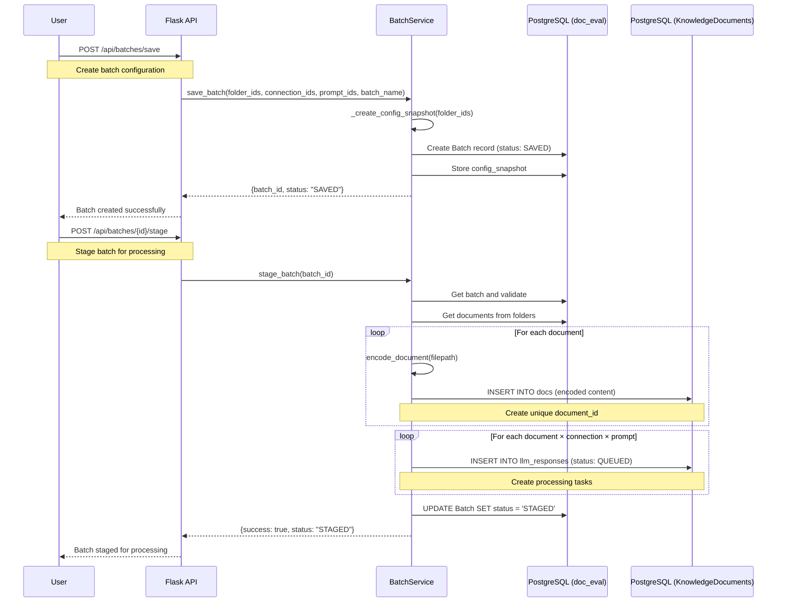
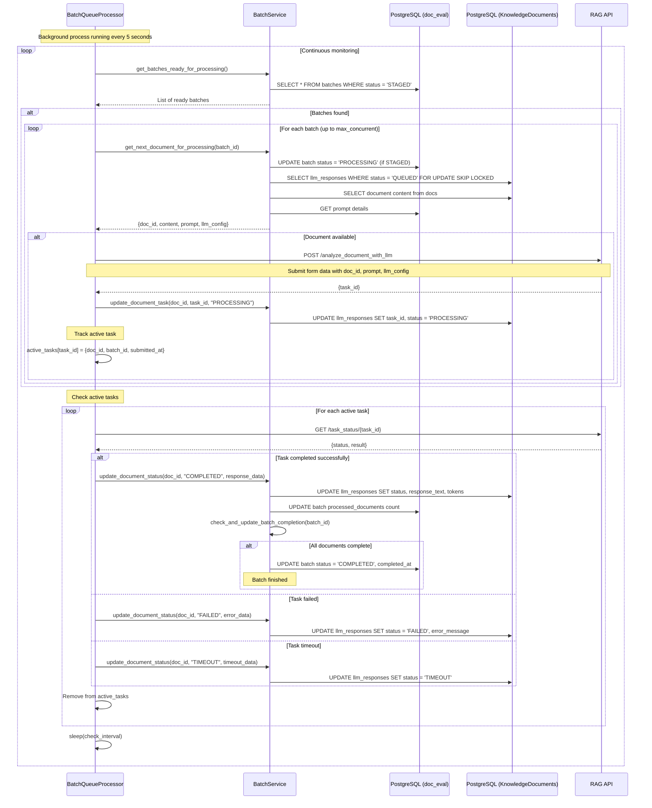
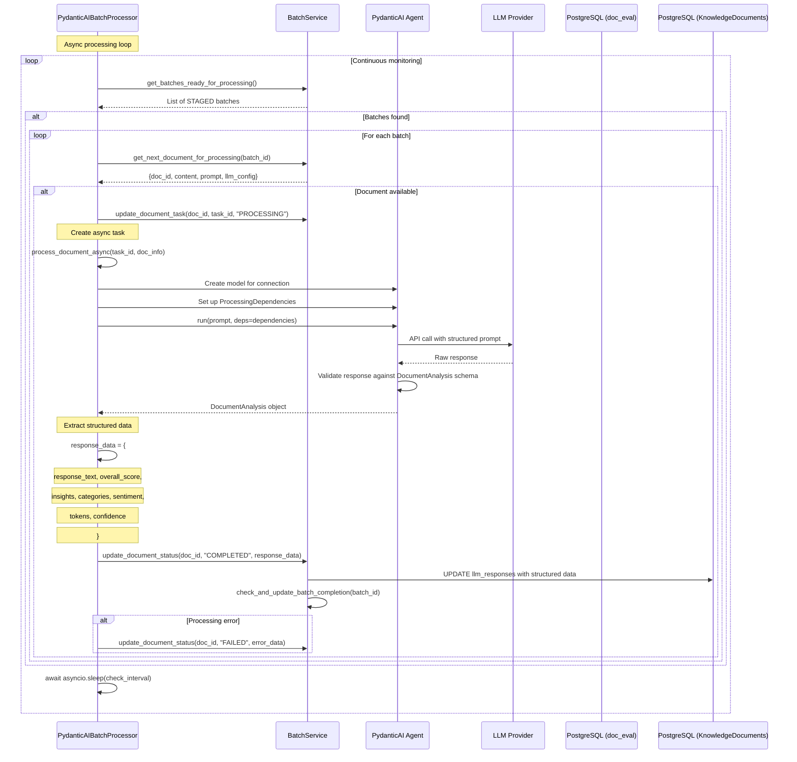
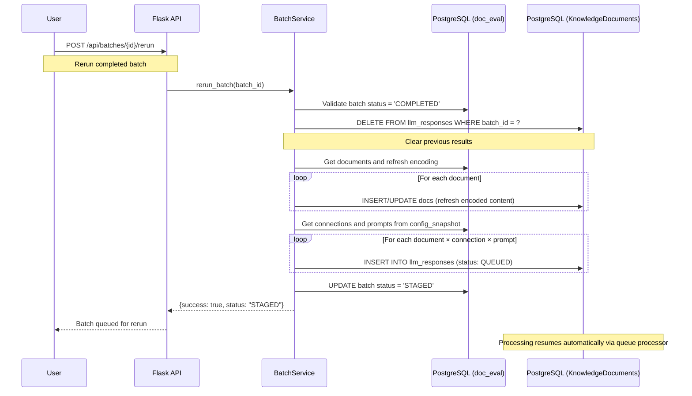
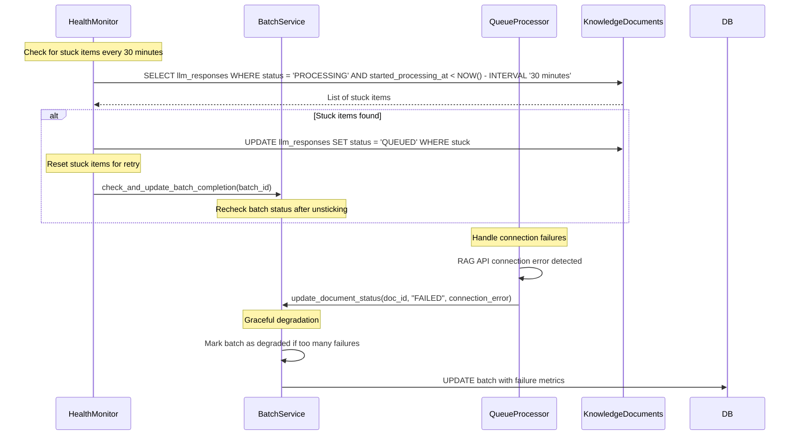

# Document Processing Workflow - Sequence Diagrams

## 1. Batch Creation and Staging

## 2. Document Processing with BatchQueueProcessor

## 3. Document Processing with PydanticAI

## 4. Batch Rerun Process

## 5. Error Handling and Recovery

## Key Features Highlighted

### 🔄 **Atomic Operations**
- `FOR UPDATE SKIP LOCKED` prevents concurrent processing
- Single document retrieval per call
- Proper transaction boundaries

### 📊 **State Management** 
- Clear state transitions: SAVED → STAGED → PROCESSING → COMPLETED
- Real-time progress tracking
- Automatic completion detection

### 🛡️ **Error Handling**
- Timeout detection and recovery
- Stuck item reset mechanisms
- Graceful failure modes

### 🚀 **Scalability**
- Concurrent task processing
- Configurable concurrency limits
- Background processing loops

### 🎯 **Flexibility**
- Support for both RAG API and PydanticAI
- Pluggable processor architecture
- Provider-agnostic design