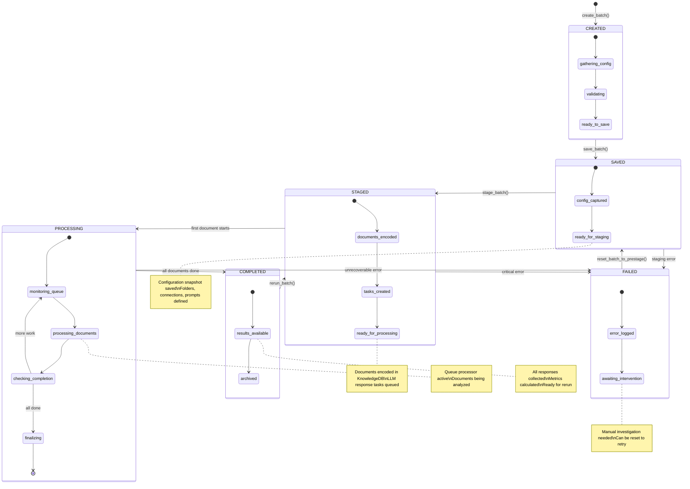
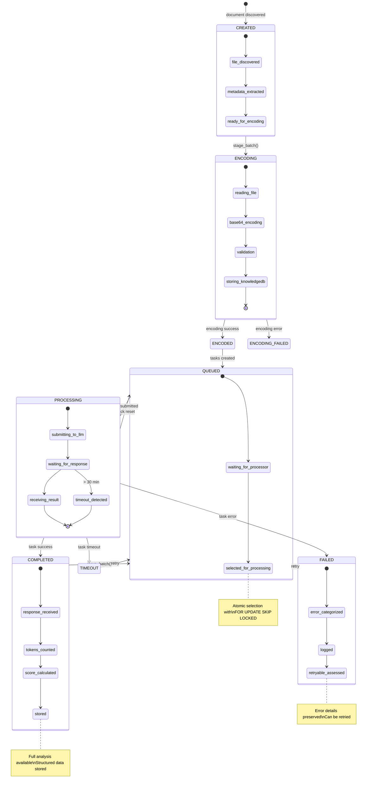
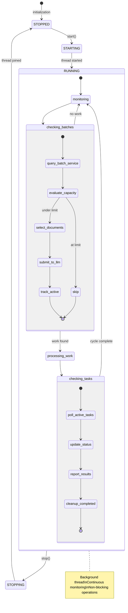
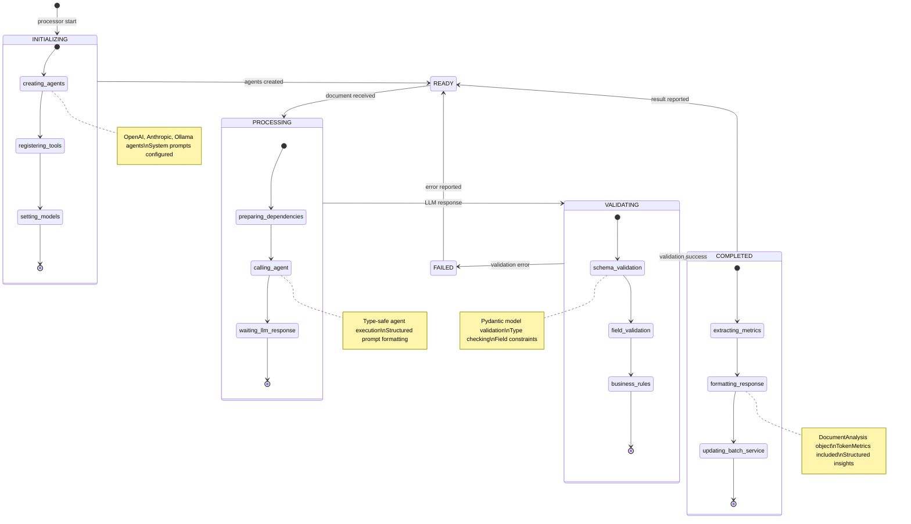
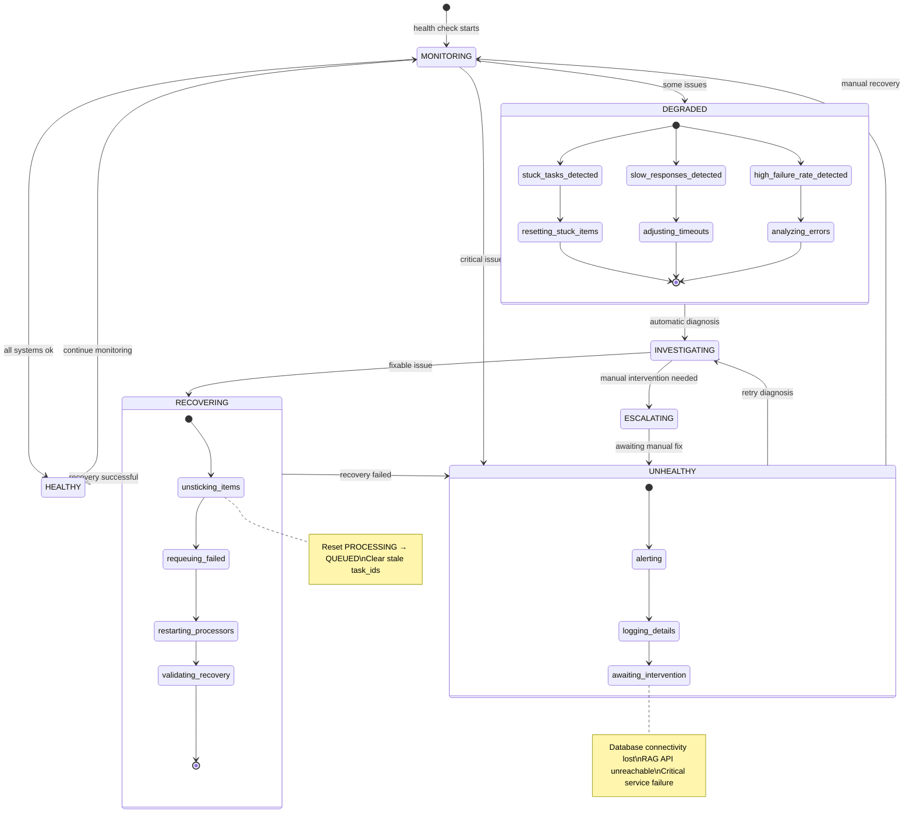

# Service State Management - State Diagrams

## 1. Batch Lifecycle States

## 2. Document Processing States

## 3. Queue Processor States

## 4. PydanticAI Agent States

## 5. Error Recovery Flow

## Key State Management Features

### 🔄 **Atomic Transitions**
- Single responsibility per state change
- Transactional consistency
- Rollback capability

### 📊 **Progress Tracking**
- Real-time state visibility
- Progress percentage calculation
- ETA estimation

### 🛡️ **Error Resilience**
- Graceful degradation paths
- Automatic recovery mechanisms
- Manual intervention points

### 🚀 **Scalable Design**
- Concurrent state management
- Lock-free where possible
- Horizontal scaling ready

### 🎯 **Observability**
- State transition logging
- Metrics collection
- Health monitoring

These state diagrams show how the implemented architecture maintains clear, predictable state management throughout the document processing lifecycle.